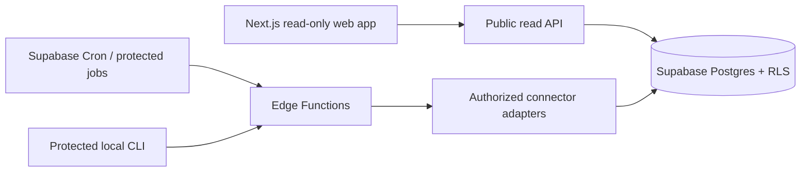

# Signal Scout

**Find the story. Do the work.**

Signal Scout is a research-discovery tool for local-language stories around real U.S.-traded gaming, platform, retail/e-commerce, and consumer-tech equities. It helps a researcher find a **research starting point**; it does not tell anyone what to believe, what a security is worth, or what to trade.

This repository intentionally contains no companies, source documents, fictional data, demo mode, or seeded research leads. The public first-run experience is an honest empty state until a user imports real profiles and configures authorized sources.

## Architecture



## Quick start

```bash
npm install
npm run dev
```

Import only real, user-supplied profiles with `scripts/import_company_profiles.ts`. See [company-profile-import](docs/company-profile-import.md), [architecture](docs/architecture.md), and [data sources](docs/data-sources.md). Copy `.env.example` to a local environment; never commit secrets.

## Product boundaries

The app never provides buy/sell/hold guidance, price or return forecasts, price targets, “not priced in” claims, portfolio actions, or trading recommendations. All output is labeled research-only and requires independent validation against primary sources.

## Development

`npm test` runs the neutral, non-content unit tests. `npm run typecheck` checks TypeScript. Docker and Supabase setup are documented in [deployment](docs/deployment.md). Scheduled jobs are disabled until sources, credentials, and budgets are configured.

Research only — not investment advice or a trading recommendation.
