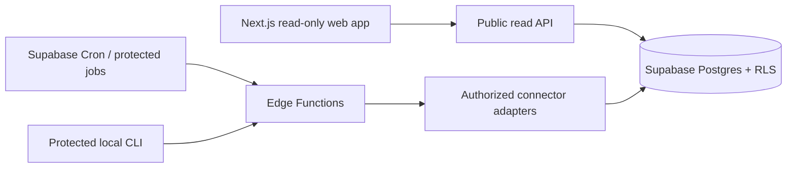

# Signal Scout

**Find the discrepancy. Investigate the story.**

Signal Scout is a cross-market narrative-divergence scanner for real U.S.-traded gaming, consumer-platform, retail/e-commerce, and consumer-technology companies. It compares a configured local-language source sample with a defined sampled English source set and produces a **Cross-Market Research Starting Point**.

This repository intentionally contains no companies, source documents, fictional data, demo mode, or seeded research leads. The public first-run experience is an honest empty state until a user imports real profiles and configures authorized sources.

## Architecture



## Quick start

```bash
npm install
npm run dev
```

Import only real, user-supplied profiles with `scripts/import_company_profiles.ts`. See [company-profile-import](docs/company-profile-import.md), [architecture](docs/architecture.md), and [data sources](docs/data-sources.md). Copy `.env.example` to a local environment; never commit secrets.

## Product thesis

Signal Scout detects differences between configured information environments. A difference is a research starting point—not evidence that a market is unaware, that an issue is financially material, or that a security should be traded.

## What Signal Scout is not

The app is not a stock screener, sentiment dashboard, alpha or inefficiency detector, trading tool, price predictor, or recommendation engine. It never provides buy/sell/hold guidance, price or return forecasts, price targets, “not priced in” claims, portfolio actions, or trading recommendations.

## Cross-market narrative topic divergence

For company A, local market L, English sample E, topic K, and time window T, each returned document gets a source-tier heuristic weight (Tier 1: 1.00; Tier 2: 0.75; Tier 3: 0.50; Tier 4: 0.25; Tier 5: 0.10) multiplied by entity confidence. A duplicate receives the default 0.10 multiplier. Weighted topic share is the weighted topic evidence divided by all weighted company-related evidence in that source set and window. Raw article counts are misleading because source quality, syndication, entity confidence, and source coverage differ.

With α=1 and β=1, smoothed share is `(topic weight + α) / (total weight + α + β)`. Narrative Topic Difference is `smoothed local share - smoothed English share`. An optional advanced log-odds ratio compares the odds of the topic in each sample. These are descriptions of configured information environments, not measures of demand, awareness, financial materiality, or future returns.

## Research Priority and evidence

Cross-Market Research Priority is a 0–100 reading-triage aid. It uses 30% recency, 25% source quality, 20% independent local-source concentration, 15% difference strength, and 10% profile/evidence quality, less an ambiguity/duplicate/staleness penalty. Recency defaults to a 72-hour half-life; concentration uses `min(1, log(1+n independent)/log(1+5))`; difference strength uses `min(1, abs(topic difference)/0.30)`. A result must meet the configured local weighted-total, topic-evidence, source-domain, entity-confidence, quality, and freshness thresholds. Without English data, the app can show a Local Research Starting Point but must say “Sampled English comparison unavailable.”

## Statistical limitations

Results are subject to user-selection bias, source-coverage bias, platform-demographic bias, language/entity ambiguity, small-sample instability, source dependence, timing differences, and the gap between online discussion and financial materiality. Scanning many companies, topics, markets, and windows creates multiple-testing false positives. Correlation is not causation. Signal Scout makes no out-of-sample performance claim.

## Development

`npm test` runs the neutral, non-content unit tests. `npm run typecheck` checks TypeScript. Docker and Supabase setup are documented in [deployment](docs/deployment.md). Scheduled jobs are disabled until sources, credentials, and budgets are configured. Import a real YAML, CSV, or JSON profile with the protected local scripts after dry-run validation; never commit `.env.local`.

## Source compliance and security

Use only documented, authorized GDELT, SEC EDGAR, RSS/Atom, Naver, or user-provided APIs. No Google Trends scraping, arbitrary HTML scraping, paywall bypass, anti-bot bypass, or unauthorized API. Connector secrets belong in local/Supabase/Vercel/GitHub Actions secret stores, never browser code or logs.

## Roadmap

Next: authenticated profile upserts, market source-set configuration, RSS/SEC/GDELT ingestion, deduplication, topic classification, candidate evaluation, and scheduled refresh. Search-attention normalization remains schema-only until an authorized trend source with historical observations is configured.

Research only — not investment advice or a trading recommendation.
