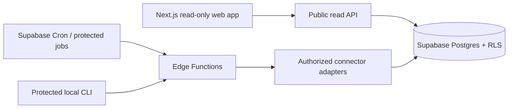

# Signal Scout

**Compare the conversation. Follow the evidence.**

Signal Scout is a research workspace for comparing public Korean-language and U.S. news and discussion samples. It helps a researcher notice differences in topic frequency or framing, inspect the underlying sources, and ask better questions. It is about understanding people and information environments—not screening stocks or generating trades.

The public first-run experience is an honest empty state until the database schema, tracked research profiles, and authorized sources are configured. Development-only sample content is synthetic and is never shown in production. Source coverage is partial and platform-demographic biases are substantial; the app must not claim to represent either population.

## Architecture


```mermaid
flowchart LR
  Browser[Next.js read-only web app] --> API[Public read API]
  API --> DB[(Supabase Postgres + RLS)]
  Jobs[Supabase Cron / protected jobs] --> Edge[Edge Functions]
  Edge --> Connectors[Authorized connector adapters]
  Connectors --> DB
  CLI[Protected local CLI] --> Edge
```

## Quick start

```bash
npm install
npm run dev
```

Import only real, user-supplied research profiles with `scripts/import_company_profiles.ts`. See [profile import](docs/company-profile-import.md), [architecture](docs/architecture.md), and [data sources](docs/data-sources.md). Copy `.env.example` to a local environment; never commit secrets.

## Product thesis

Signal Scout detects differences between configured information environments. A difference is a research starting point—not evidence that a market is unaware, that an issue is financially material, or that a security should be traded.

## What Signal Scout is not

The app is not a stock screener, sentiment dashboard, alpha or inefficiency detector, trading tool, price predictor, or recommendation engine. It never provides buy/sell/hold guidance, price or return forecasts, price targets, “not priced in” claims, portfolio actions, or trading recommendations.

## Cross-market narrative topic divergence

For a tracked topic or entity, local market L, English-language sample E, topic K, and time window T, each returned document gets a source-tier heuristic weight (Tier 1: 1.00; Tier 2: 0.75; Tier 3: 0.50; Tier 4: 0.25; Tier 5: 0.10) multiplied by entity confidence. A duplicate receives the default 0.10 multiplier. Weighted topic share is the weighted topic evidence divided by all weighted evidence in that source set and window. Raw post/article counts are misleading because source quality, syndication, query selection, and source coverage differ.

With α=1 and β=1, smoothed share is `(topic weight + α) / (total weight + α + β)`. Narrative Topic Difference is `smoothed local share - smoothed English share`. An optional advanced log-odds ratio compares the odds of the topic in each sample. These are descriptions of configured information environments, not measures of demand, awareness, financial materiality, or future returns.

## Research Priority and evidence

Cross-Market Research Priority is a 0–100 reading-triage aid. It uses 30% recency, 25% source quality, 20% independent local-source concentration, 15% difference strength, and 10% profile/evidence quality, less an ambiguity/duplicate/staleness penalty. Recency defaults to a 72-hour half-life; concentration uses `min(1, log(1+n independent)/log(1+5))`; difference strength uses `min(1, abs(topic difference)/0.30)`. A result must meet the configured local weighted-total, topic-evidence, source-domain, entity-confidence, quality, and freshness thresholds. Without English data, the app can show a Local Research Starting Point but must say “Sampled English comparison unavailable.”

## Statistical limitations

Results are subject to user-selection bias, source-coverage bias, platform-demographic bias, language/entity ambiguity, small-sample instability, source dependence, timing differences, and the gap between online discussion and financial materiality. Scanning many companies, topics, markets, and windows creates multiple-testing false positives. Correlation is not causation. Signal Scout makes no out-of-sample performance claim.

## Development

`npm test` runs the neutral, non-content unit tests. `npm run typecheck` checks TypeScript. Docker and Supabase setup are documented in [deployment](docs/deployment.md). Scheduled jobs are disabled until sources, credentials, and budgets are configured. Import a real YAML, CSV, or JSON profile with the protected local scripts after dry-run validation; never commit `.env.local`.

## Source compliance and security

Use only documented, authorized GDELT, SEC EDGAR, RSS/Atom, Bluesky, Hacker News, or user-provided APIs. No Kakao/Naver dependency, Google Trends scraping, arbitrary HTML scraping, paywall bypass, anti-bot bypass, or unauthorized API. Connector secrets belong in local or server-side secret stores, never browser code, logs, or GitHub.

## Roadmap

Next: configure a legally authorized Korean public-conversation source, deploy the database migrations, set private production environment variables, add provenance-aware topic classification, and validate comparison quality with real users. Search-attention normalization remains schema-only until a free, authorized trend source with historical observations is configured.

Research only — not investment advice or a trading recommendation.
